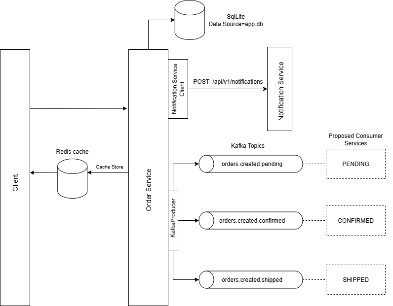

# Architectural Diagram

The system is designed with a microservices approach, where the `OrderService` and `NotificationService` are independent, deployable units. This provides flexibility and scalability.

* **OrderService**: The main application and REST API that handles all order-related business logic.
* **NotificationService**: A separate, lightweight service that receives HTTP notifications from the `OrderService`.
* **External Dependencies**: The `OrderService` interacts with **Redis** for caching and **Kafka** for event-driven communication.
* **Database**: A **SQLite** database managed by Entity Framework Core is used for data persistence.