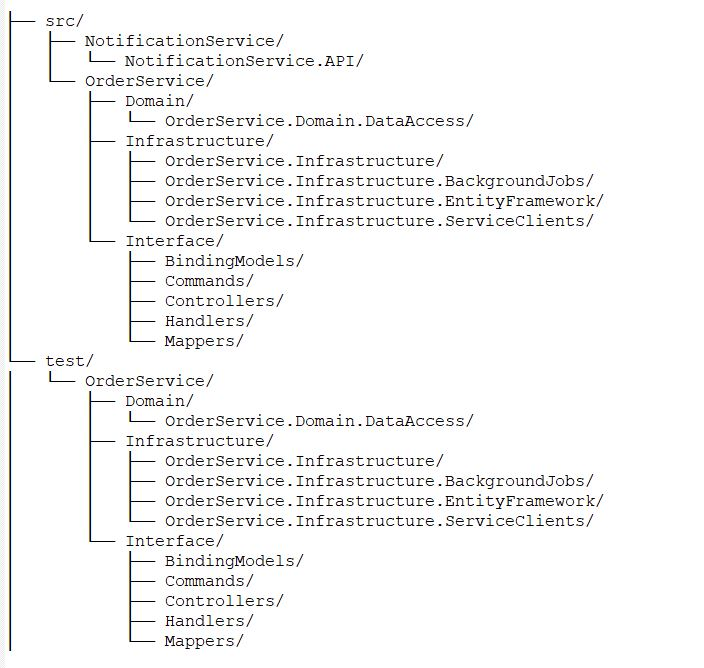

# Code Structure and Architectural Decisions

The solution is organized to follow **Clean Architecture** or **Onion Architecture** principles, ensuring a clear separation of concerns, high testability, and maintainability.

## 📂 Project Structure

## 🧠 Architectural Decisions

* **Microservices Approach**: The explicit separation of `NotificationService.API` and `OrderService` into distinct projects demonstrates a clear microservices strategy. This allows for independent development, deployment, and scaling of each service.
* **Clean Architecture (Onion Architecture)**: The division into `Domain`, `Infrastructure`, and `Interface` layers shows a commitment to this pattern. This design ensures that the core business logic in the **`Domain`** layer is not dependent on external concerns.
* **CQRS with MediatR**: The presence of `Commands` and `Handlers` is a classic implementation of **CQRS (Command Query Responsibility Segregation)**. This pattern cleanly separates methods that change state (`Commands`) from methods that retrieve state (`Queries`), handled by MediatR for a more organized codebase.
* **Single Responsibility Principle (SRP)**: The `Infrastructure` layer is further divided into specialized projects (`.EntityFramework`, `.BackgroundJobs`, `.ServiceClients`). This adheres to SRP, ensuring each project has a single, well-defined responsibility, which significantly improves maintainability and testability.